# Wake Park Software Installation Guide

The following installation guide navigates the user through running our project, Wake Park. Overall your system will need two external applications other than your usual code editor which include two applications named Android Studio, and Expo Go. 

## Table of Contents:
1. System Requirements
2. Download the installer
3. Installing the software
4. Launching the software
5. Uninstalling the software
6. Troubleshooting
7. Contact information

### System Requirements
The System Requirements for running all the Wake Park applications are below 

**Windows**
- Microsoft® Windows® 7/8/10 (64-bit)
- 4 GB RAM minimum, 8 GB RAM recommended
- 2 GB of available disk space minimum, 4 GB recommended (500 MB for IDE + 1.5 GB for Android SDK and emulator system image)
- 1280 x 800 minimum screen resolution
- Microsoft® DirectX® 9 or higher with the latest updates
- JDK 8 (included with Android Studio for Windows) or higher

**macOS**
- macOS® 10.10 (Yosemite) or higher, up to macOS 12.x (Monterey)
- 4 GB RAM minimum, 8 GB RAM recommended
- 2 GB of available disk space minimum, 4 GB recommended (500 MB for IDE + 1.5 GB for Android SDK and emulator system image)
- 1280 x 800 minimum screen resolution
- Oracle® Java Development Kit (JDK) 8

**Linux**
- GNOME or KDE desktop
- Tested on Ubuntu® 14.04 LTS, 16.04 LTS, and 18.04 LTS (64-bit)
- 4 GB RAM minimum, 8 GB RAM recommended
- 2 GB of available disk space minimum, 4 GB recommended (500 MB for IDE + 1.5 GB for Android SDK and emulator system image)
- 1280 x 800 minimum screen resolution
- Oracle® Java Development Kit (JDK) 8 or OpenJDK™ 11

### Download The Software Installer
Our app runs on a multitude of different softwares listed below. The links are also provided to be able to download and install them.

**VISUAL STUDIO CODE**

    How to Install:
    - Navigate to the visual studio code website: 

    https://code.visualstudio.com/download
    
    Depending on your operating system, you can choose one of the following options.

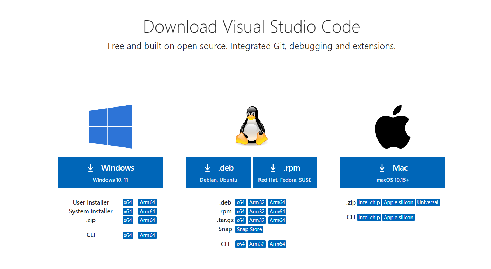

**EMULATOR**

    How to Install:
    - Navigate to the android studio website:

    https://developer.android.com/studio

    Our team used android, but there are tutorials out there on how to use ios.

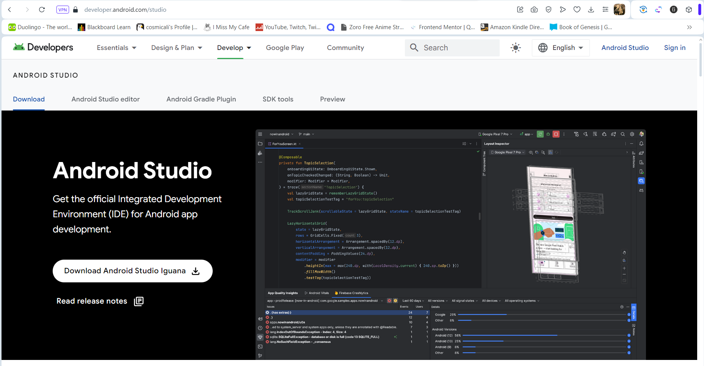

    The video link on how to install the android emulator from android studio:

    https://www.youtube.com/watch?v=ZGIU5aIRi9M&t=228s

**EXPO GO**

    You can either download the android studio (android emulator) or download the expo go app on your phone to run the app.

    How to Install:
    - Navigate to either the app store of google play store and install "Expo"

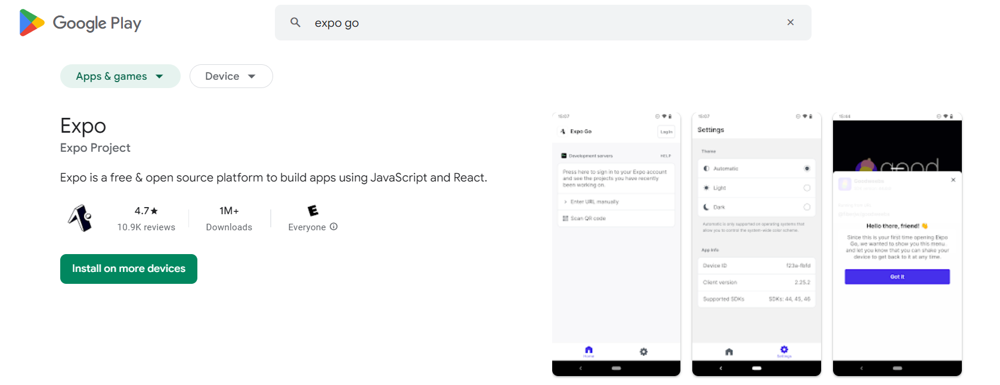
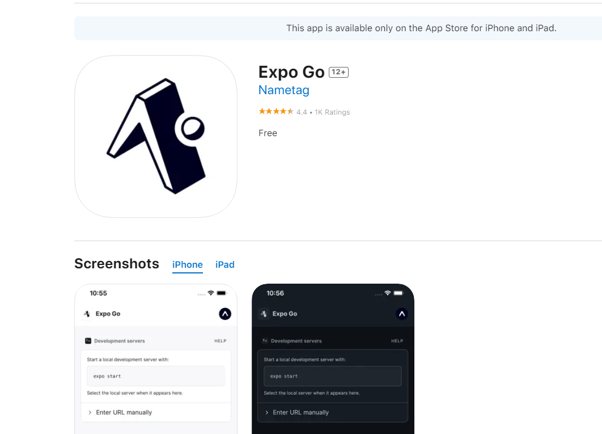

**NODE.JS**

    How to Install:
    - Navigate to the NodeJS website and download the software:

    https://nodejs.org/en/download

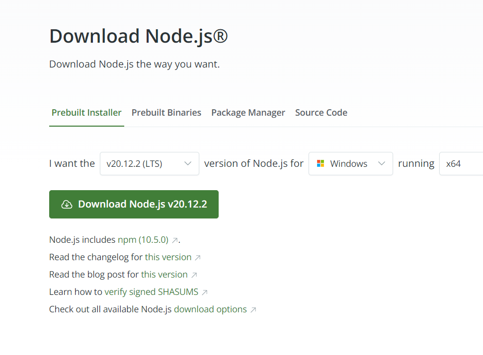

**REACT NATIVE**

    Here is the website to help you set up your react native environment:

    https://reactnative.dev/docs/environment-setup

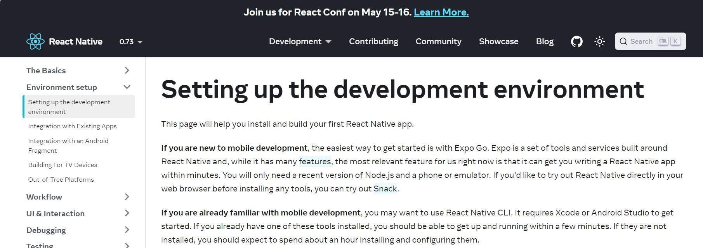

    Here is also a youtube video describing how to set up the react native development environment:

    https://www.youtube.com/watch?v=oorfevovPWw

### Installing the Software

1. Download the WakePark app from GitHub
    - Download the project from the GitHub page at https://github.com/3osmic/WakePark
    - Create a folder where you would like the application to be located.
    - Extract the download zip into your desired project location.

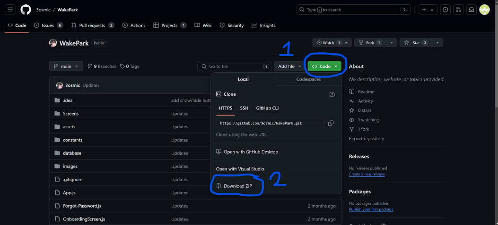

2. Install Node.js
    - Download the latest version at https://nodejs.org/en/download, and ensure that you select the correct version for your operating system.
    - Run the downloaded installer.
    - Follow the installation setup.
    - When asked about optional tools to compile native modules, you do not need to select the checkbox.
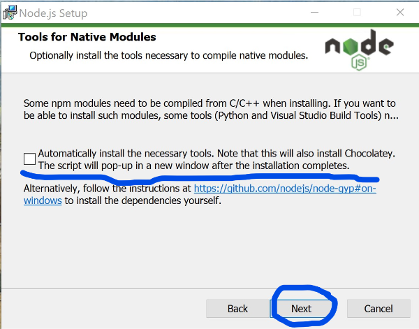
    - Proceed throughout the rest of the installer until it is finished.
    - You may run “node -v” in your terminal to ensure node.js is properly installed, as this command should return your current node.js version.

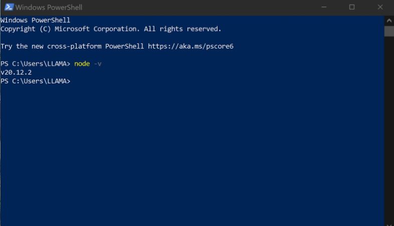

3. Install Expo on your phone
    - Visit either the Google Play store or Apple App Store and search for the Expo app.
    - After finding the app, select to download.
    - Wait for the download to finish and you should now have access to the Expo app on your device.
    
4. Install Android Studio on your computer
    - If you prefer accessing our app on your computer, you can download Android Studio and run the app on an emulator.  Ensure that you have the system requirements to meet the demands of Android Studio here: https://developer.android.com/studio/run/emulator#requirements 
    - Download Android Studio from here: https://developer.android.com/studio 
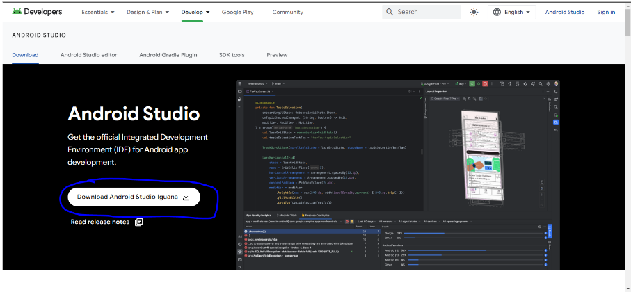
    - After your download is complete, launch the installer and follow the instructions and make any configurations you wish.
    - Once it is finished installing, you may choose to launch Android Studio.

5. Setup an Android emulator
    - Open up the WakePark app directory as Android Studio Project.
    - Search for the device manager tab, mine is on right side, but the location may be different based on your version.
    - From the device manager tab, select the plus to create a virtual device.
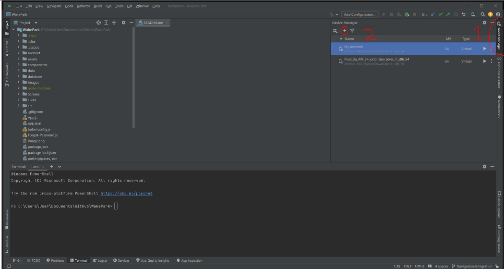
    - You can choose just about any hardware option, but it is recommended you choose Medium Phone.
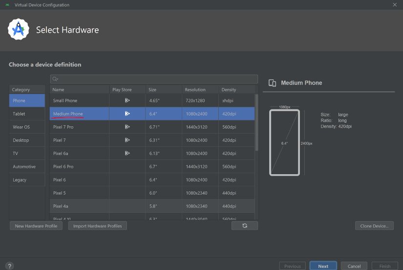
    - After that, it is recommended that choose UpsideDownCake for your system image to run the WakePark App.  It will take time for you to download this system image.
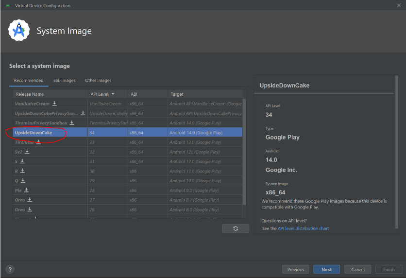
    - Finally, provide a name for your emulator and select finish.

### Launching the Software
Once you have everything installed, to launch the app you’ll need to:

1. Navigate to the extracted project folder in your file explorer and click the **File** tab at the top left of the window and choose **Open in Windows Powershell**.
    - Note: if you have trouble with the following steps, run windows powershell as an administrator

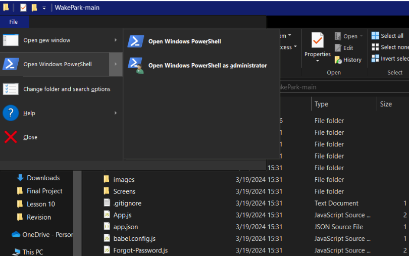

2. Next, run the command **npm install**.

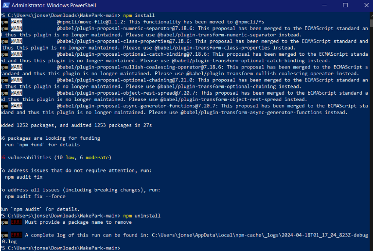

3. Then run the command npm start and scan the QR code with your mobile device or press a on your keyboard if you are using the emulator.

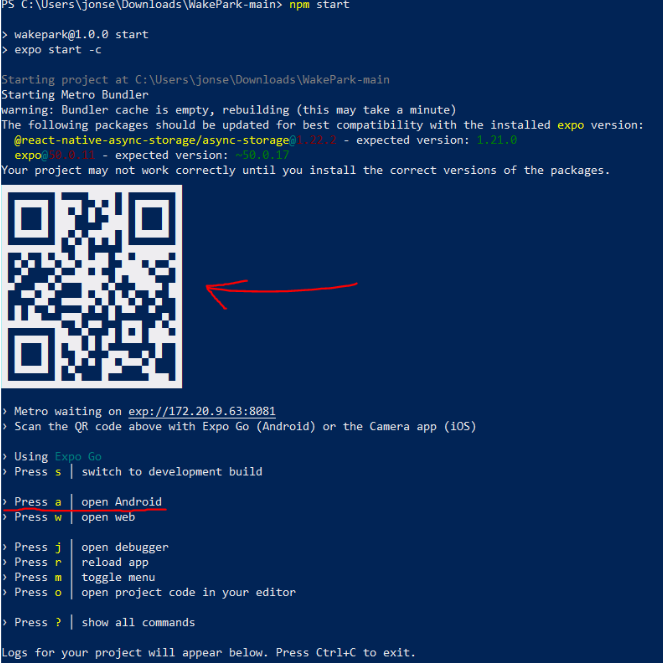

4. Then you should be in the app.

### Uninstalling the Software

### Troubleshooting

### Contact and Support
For additional support, please do not hesitate to contact any of the following developers:

**Team Lead:** aylewis@my.waketech.edu

**Team Member:** dlingle@my.waketech.edu

**Team Member:** smukherjee2@my.waketech.edu

**Team Member:** srotich@my.waketech.edu

**Team Member:** znjones@my.waketech.edu

**Team Member:** ymshettia@my.waketech.edu

#### Software Support Resources

**VS Code:** https://code.visualstudio.com/

**Emulator (Android Studio):** https://developer.android.com/studio

**React Native Framework:** https://reactnative.dev/

**Expo Go:** 
- https://expo.dev/go
- https://docs.expo.dev/get-started/expo-go/

**Node.js:** https://nodejs.org/en; https://nodejs.org/docs/latest/api/
